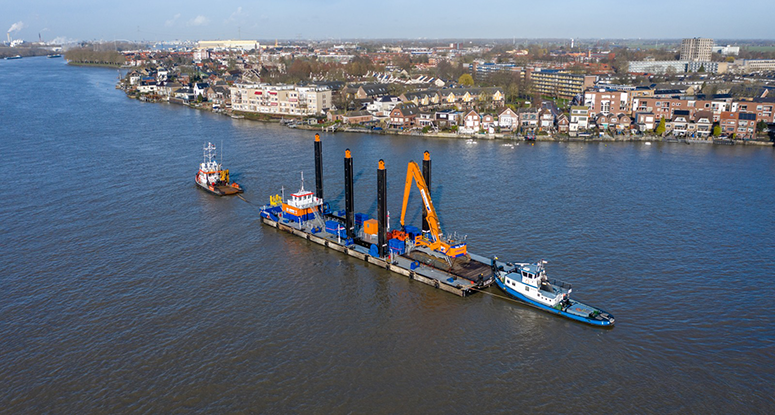
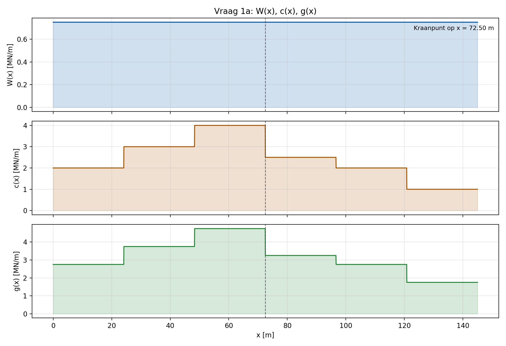
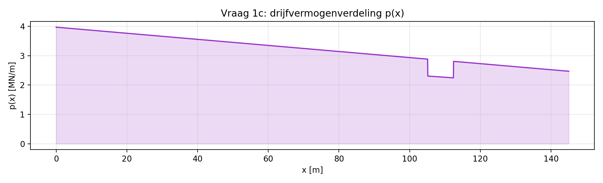
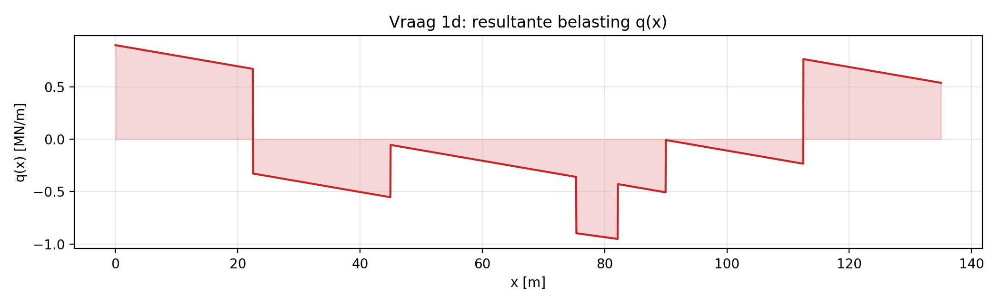
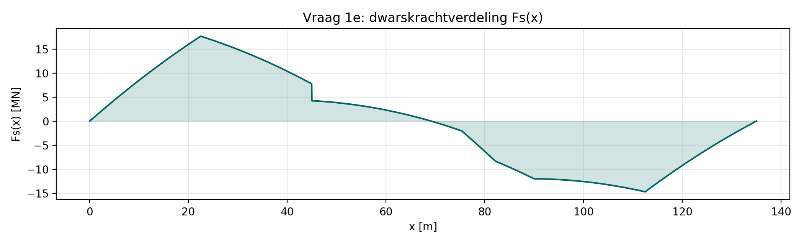
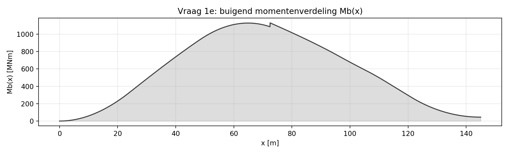
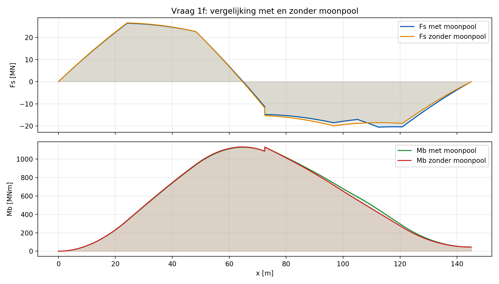
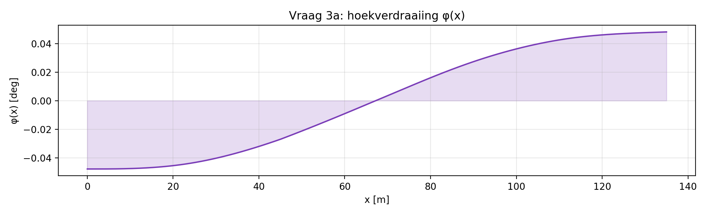
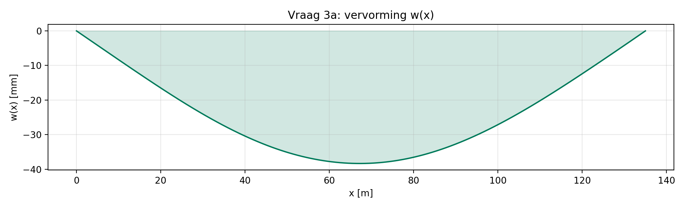

# MT1464 – Opdracht 1
## Verslag
### Jan Albert Driessen
### 6470114

\newpage

## 1. Uitwendige en inwendige belasting

### 1a
De gewichtscomponenten zijn opgesteld als:

$$
W(x)=-\left(W_{\mathrm{const}} + P_{\mathrm{kraan}}\,\delta(x-x_c)\right),\qquad
c(x)=-\left(c_{\mathrm{seg}}(x)+P_{\mathrm{SWL}}\,\delta(x-x_c)\right),
$$
$$
g(x)=W(x)+c(x).
$$

Met $P_{\mathrm{kraan}}=2.0\ \mathrm{MN}$, $P_{\mathrm{SWL}}=1.5\ \mathrm{MN}$ en $x_c=45.00\ \mathrm{m}$.

### 1b
Gebruikte formules:

$$
A_{wp}=\int_0^L b_{eff}(x)\,dx,\quad
LCF=\frac{\int_0^L x\,b_{eff}(x)\,dx}{A_{wp}}
$$
$$
W_{tot}=\int_0^L -g(x)\,dx + P_{\mathrm{kraan}}+P_{\mathrm{SWL}},
\quad
LCG=\frac{\int_0^L x\,(-g(x))\,dx + x_c(P_{\mathrm{kraan}}+P_{\mathrm{SWL}})}{W_{tot}}
$$
$$
T_0=\frac{W_{tot}}{\rho_w g A_{wp}},
\quad
T(x)=T_0+a(x-LCF),
\quad
a=\frac{W_{tot}(LCG-LCF)}{\rho_w g I_2}
$$
$$
t(x)=a(x-LCF),\qquad t_a=t(0),\qquad t_f=t(L).
$$

Resultaten (afgerond op 2 decimalen):  
- $T=8.89\ \mathrm{m}$  
- $LCF=67.39\ \mathrm{m}$  
- $LCG=61.81\ \mathrm{m}$  
- $t_a=2.18\ \mathrm{m}$  
- $t_f=-2.18\ \mathrm{m}$
- Notatie: $t_a$ = voor; $t_f$ = achter.

### 1c
Drijfvermogenverdeling:

$$
p(x)=\rho_w g\,b_{eff}(x)\,T(x)
$$

### 1d
Resultante vlakwaterbelasting:

$$
q(x)=p(x)+g_{dist}(x)
$$

met evenwichtscontrole inclusief puntlasten:

$$
\int_0^L q(x)\,dx - (P_{\mathrm{kraan}}+P_{\mathrm{SWL}})\approx 0
$$
$$
\int_0^L (x-LCF)q(x)\,dx -(P_{\mathrm{kraan}}+P_{\mathrm{SWL}})(x_c-LCF)\approx 0
$$

Numeriek:  
- krachtsevenwicht: 3.025e-07\ \mathrm{MN}  
- momentevenwicht: 5.617e-06\ \mathrm{MNm}

### 1e
Inwendige snedekrachten:

$$
F_s(x)=\int_0^x q(\xi)\,d\xi - H(x-x_c)(P_{\mathrm{kraan}}+P_{\mathrm{SWL}})
$$
$$
M_b(x)=\int_0^x F_s(\xi)\,d\xi + H(x-x_c)\,P_{\mathrm{SWL}}\,R
$$

met $R=30\ \mathrm{m}$ en $H(\cdot)$ de Heaviside-stapfunctie.

### 1f
Vergelijking met/zonder moonpool toont lokaal sterkere variatie bij moonpool door lager effectief waterlijnoppervlak.  
Maximaal verschil:

$$
\max|F_{s,met}-F_{s,zonder}|=1.842\ \mathrm{MN},\qquad
\max|M_{b,met}-M_{b,zonder}|=54.533\ \mathrm{MNm}.
$$

### 1g
Controlevoorwaarden aan de uiteinden:

$$
F_s(0)=0,\ M_b(0)=0,\ F_s(L)\approx0,\ M_b(L)=M_{\mathrm{extern}}
$$

Aanvullend moet gelden:

$$
\frac{dF_s}{dx}=q(x),\qquad \frac{dM_b}{dx}=F_s(x)
$$

De numerieke checks op deze relaties zijn uitgevoerd en klein.

## 2. Constructie eigenschappen

### 2a
Verticale delen domineren schuifstijfheid, omdat schuif vooral via web-achtige platen loopt.

$$
A_s=5H(2t_p)=10Ht_p
$$

Met $t_p=7.5\ \mathrm{mm}$:

$$
A_s=1.16\ \mathrm{m^2}
$$

### 2b

$$
z_n=\frac{\sum A_i z_i}{\sum A_i}=\frac H2=7.75\ \mathrm{m}
$$

### 2c

$$
I_b=\sum_i\left(I_{\mathrm{eigen},i}+A_i d_i^2\right)
$$

Horizontaal (per plaat):

$$
I_{h,\mathrm{eigen}}=0.000070\ \mathrm{m^4},\quad
A_hd_h^2=55.642109\ \mathrm{m^4},\quad
I_{h,tot}=55.642179\ \mathrm{m^4}
$$

Verticaal (per plaat):

$$
I_{v,\mathrm{eigen}}=4.654844\ \mathrm{m^4},\quad
A_vd_v^2=0.000000\ \mathrm{m^4},\quad
I_{v,tot}=4.654844\ \mathrm{m^4}
$$

Totaal:

$$
I_b=2I_{h,tot}+5I_{v,tot}=134.5586\ \mathrm{m^4}
$$

### 2d
Dek en bodem liggen het verst van de neutrale as; dikte daar verhogen geeft de grootste winst in buigstijfheid en buigsterkte.

### 2e
Verticale delen koppelen dek en bodem, nemen schuif op en zorgen dat de samengestelde doorsnede effectief samenwerkt in buiging.

### 2f
Voor deze opdracht is $t_{p,eq}=7.5\ \mathrm{mm}$.  
In de Damen-documentatie staan principediktes zoals **shell 16 mm** en **longitudinale schotten 14/10 mm**.  
Het verschil is logisch: hier wordt met een vereenvoudigde equivalente dikte gerekend voor globale balkrespons; een echt ontwerp gebruikt locatie-afhankelijke plaatdiktes.

## 3. Constructie respons en limiet gedrag

Materiaal (op basis van $e=1$): Staal S235J2,  
$\sigma_y=235\ \mathrm{MPa}$, $E=205000\ \mathrm{MPa}$, $\nu=0.3$, $\rho=7800\ \mathrm{kg/m^3}$.

### 3a
Euler-Bernoulli relaties:

$$
\kappa(x)=\frac{M_b(x)}{E I_b},\qquad
\varphi(x)=\int_0^x \kappa(\xi)\,d\xi,\qquad
w(x)=\int_0^x \varphi(\xi)\,d\xi
$$

waarbij een lineaire rigid-body component is verwijderd zodat $w(0)=w(L)=0$.

Resultaten:

$$
\varphi_{\max}=0.0482^\circ,\quad
\varphi_{\min}=-0.0479^\circ
$$
$$
w_{\max}=0.00\ \mathrm{mm},\quad
w_{\min}=-38.34\ \mathrm{mm}
$$

### 3b
Maximale buigspanning (dek en bodem, zelfde absolute waarde):

$$
\sigma_{b,\max}=\frac{|M_{b,\max}|\,z_{\max}}{I_b}
$$

met $|M_{b,\max}|=611.76\ \mathrm{MNm}$ op $x=69.17\ \mathrm{m}$ en $z_{\max}=H/2=7.75\ \mathrm{m}$:

$$
\sigma_{b,\max}=35\ \mathrm{MPa}
$$

Vergelijking met vloeigrens: $35 < 235\ \mathrm{MPa}$.  
Er treedt geen plastisch gedrag op.

### 3c
Een effectieve maatregel is het verhogen van sectiemodulus (bijv. extra dek/bodem-dikte of grotere holte), zodat bij gelijk moment de buigspanning daalt. Dit verhoogt veiligheid en verlengt de vermoeiingslevensduur.

### 3d
Gemiddelde schuifspanning:

$$
\tau_s=\frac{|F_{s,\max}|}{A_s}
$$

met $|F_{s,\max}|=17.66\ \mathrm{MN}$ op $x=22.50\ \mathrm{m}$:

$$
\tau_s=15\ \mathrm{MPa}
$$

Vergelijking: $\tau_s\approx 15\ \mathrm{MPa}$ versus $\sigma_{b,\max}\approx 35\ \mathrm{MPa}$.  
Deze zijn van dezelfde orde, maar buiging domineert de extreme spanningen doordat $M_b$ piekt waar afstand tot neutrale as maximaal doorwerkt.
